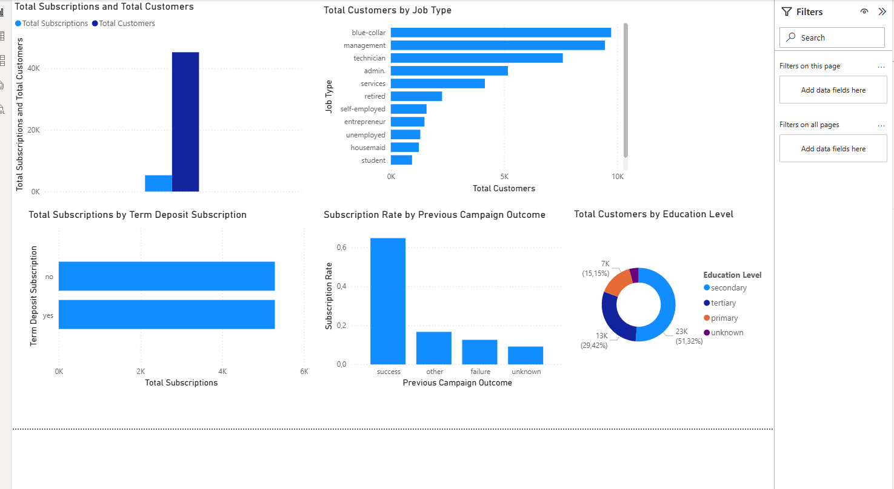

# Bank Marketing Data Analysis (Power BI)

## Project Overview
This project analyses a bank marketing campaign dataset to identify customer characteristics and campaign factors influencing term deposit subscriptions.

The analysis was conducted using Power BI to create an interactive dashboard that provides insights into customer demographics, campaign performance and subscription behaviour.

## Tools Used
- Power BI
- SQL concepts
- Data cleaning and transformation
- Data visualisation
- DAX measures

## Key Insights
- Customers in management and technician roles represent a large portion of the client base.
- Previous successful campaigns significantly increase the probability of subscription.
- Secondary education represents the largest segment of customers.

## Dashboard

## Dataset
Bank Marketing Dataset

## Skills Demonstrated
- Data cleaning
- Data transformation
- Data modelling
- Business intelligence reporting
- Analytical thinking bank-marketing-data-analysis
Bank Marketing Campaign Analysis using Power BI.  This project explores customer demographics and campaign performance to identify factors influencing term deposit subscriptions.
